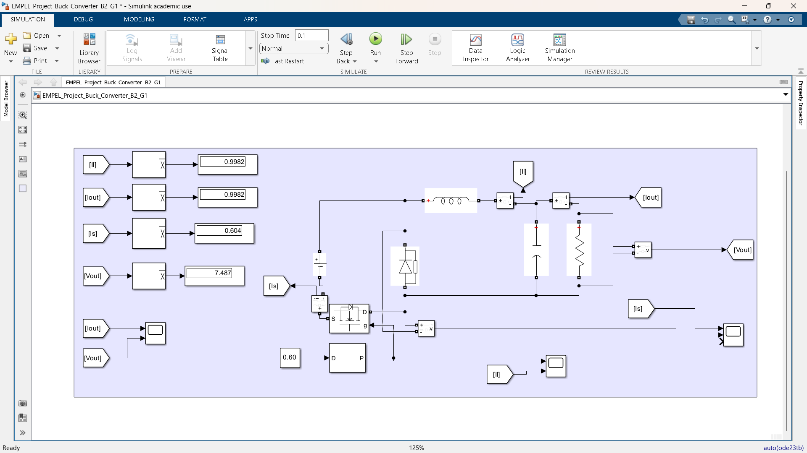
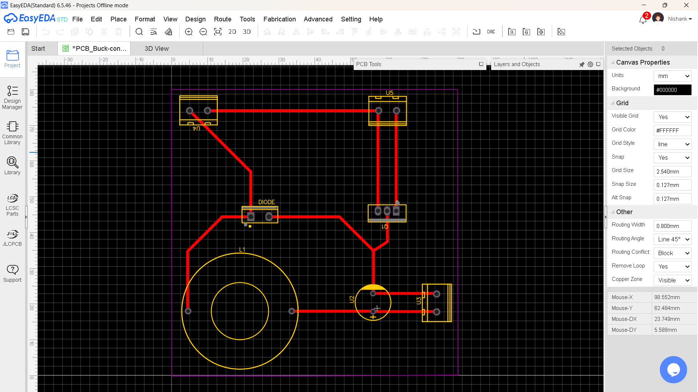
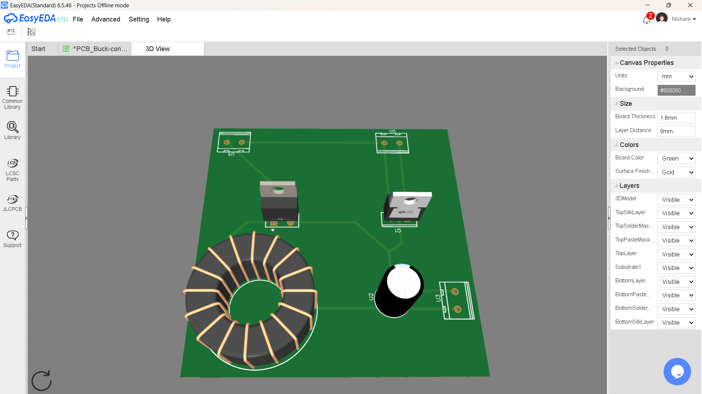

# Buck_Converter_Project
Design, Simulation and Implementation of DC-DC Buck Converter.

<h2>Simulation</h2>

<h2>PCB Design</h2>

<h2>3D PCB View</h2>

## Specifications
- Input Voltage: 12.5 V
- Output Voltage: 7.5 V
- Switching Frequency: 12.5 kHz
- Output Power: 7.5 Watt

## Software Used
- MATLAB 

## Results
- Output Voltage: 6.6 V
- Output Power: 6.6 Watt
- Efficiency: 72 %

## Author
Nishank
Indian Institute of Technology Indore
